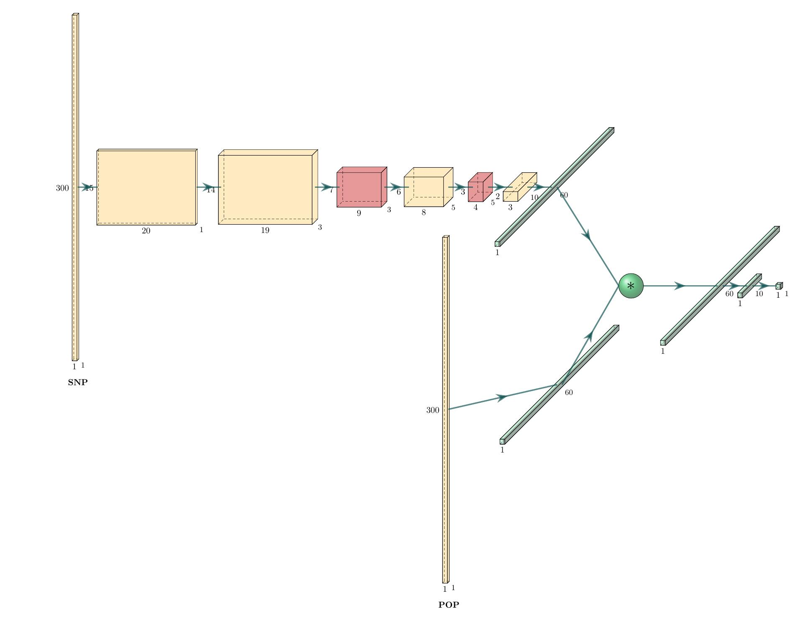

## Table of contents
* [General info](#general-info)
* [Dependencies](#Dependencies)
* [How to start](#How-to-start)
* [Usage](#usage)

## General info
GWANN is a deep learning algorithm implementing a convolutinal nerual network (CNN) to identify genetic variation that is associated with a trait of intrest. 
To facilitate the use of the CNN, the genotype 	information was converted into a learnable image that allows to disinguish between causative and non-causative SNPs. 

## Dependencies
* GENOME ([download](https://csg.sph.umich.edu/liang/genome/download.html))
* python2 (for [pheosim](https://bmcbioinformatics.biomedcentral.com/articles/10.1186/1471-2105-12-265)) 
* python>=3.8

## How to start 

To clone and run this application, you'll need [Git](https://git-scm.com) and python pip. 
GWANN accepts Genotype data as compressed vcf format and a trait file (phenotype) in csv format with two columns: individuals names, and the trait scores for each individual. The trait file must contain headers where 'sample' should be used as header for the individuals names column and any trait name for the trait scores column.
From your command line:

```bash
# Clone this repository
$ git clone --recurse-submodules https://github.com/hubner-lab/GWANN.git

# Create Virtual Environment (Optional)
$ virtualenv -p python3.8 myenv
$ source myenv/bin/activate

# Go into the repository
$ cd GWANN 

# Install dependencies
$ pip install -r requirements.txt 
```

## Example 

```bash
# Simulate 100 popluations with 10000 SNPS, 1 subpopulation of 300 individuals, and 1 causative SNP 
$ python3 GWANN.py simulate -p 10000 -P 1 -s 300 -n 100 -S 1

# Train the network for 500 epochs with a randomly sampled 30 SNP (causative SNP included)
# a training-validation ratio of 70/30, image width of 15 columns and the path to the simulated data 
$ python3 GWANN.py train -e 500 -S 30 -r 0.7 -w 15 --path simulation/data/ --verbose

# Predict causative SNPs on real data INPUT.vcf.gz with trait Plant_Height 
# using the model generated in previous step and output results to output.csv and output.png
$ python3 GWANN.py run --vcf INPUT.vcf.gz --pheno INPUT.pheno -t Plant_Height --model models/net-accuracy.pt --output output 

```

## Usage

```bash
python3 GWANN.py --help

Usage: GWANN.py [OPTIONS] COMMAND [ARGS]...

Options:
  --help  Show this message and exit.

Commands:
  run       Run on real data
  simulate  Simulate training data
  train     Train the model on the simulated data

```

```bash
python3 GWANN.py simulate --help

Usage: GWANN.py simulate [OPTIONS]

  Simulate training data

Options:
  -p, --number-of-snps INTEGER    number of SNPs in each simulation
                                  [required]
  -P, --number-of-subpopulations INTEGER
                                  number of expected subpopulations
                                  [required]
  -s, --samples INTEGER           number of individuals  [required]
  -n, --number-of-simulation INTEGER
                                  number of populations to be simulated
                                  [required]
  -S, --causal_snps INTEGER       number of causal SNPs expected per number of
                                  SNPs
  -m, --maf FLOAT                 minor allele frequency
  --miss FLOAT                    proportion of missing data
  --equal_variance / ;            set this if equal variance is expected among
                                  SNPs (ignore for single SNP)
  --help                          Show this message and exit.

```

```bash
python3 GWANN.py train --help
Usage: GWANN.py train [OPTIONS]

  Train the model on the simulated data

Options:
  -e, --epochs INTEGER  number of training iterations
  -S, --SNPs INTEGER    number of SNPs to be sampled randomly  [required]
  -b, --batch INTEGER   batch size
  -r, --ratio FLOAT     train / eval ratio
  -w, --width INTEGER   image width must be a divisor of the number of
                        individuals
  --path TEXT           path to the simulated data  [required]
  --verbose / ;         increase verbosity
  --deterministic / ;   set for reproducibility
  --help                Show this message and exit.

```

```bash
python3 GWANN.py run --help

Usage: GWANN.py run [OPTIONS]

  Run on real data

Options:
  -v, --vcf TEXT    path to the VCF file  [required]
  -p, --pheno TEXT  path to the phenotype file (comma seperated csv file)
                    [required]
  -t, --trait TEXT  name of the trait (header in the phenotype file)
                    [required]
  --model TEXT      path to the network model generated in the training step
  --output TEXT     prefix of output plot and causative SNPs indexes in the
                    VCF
  --help            Show this message and exit.

```


## Net 

