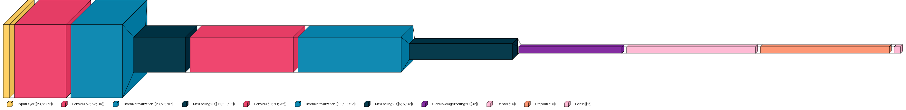

## Table of contents
- [Create Virtual Environment (Optional)](#create-virtual-environment-optional)
- [Go into the repository](#go-into-the-repository)
- [Install python dependencies](#install-python-dependencies)
- [Install geno command and authorize scripts](#install-geno-command-and-authorize-scripts)
- [Install real data to test GWANN (Optional)](#install-real-data-to-test-gwann-optional)
  - [Example](#example)
  - [Usage](#usage)
  - [Net](#net)

## General info
GWANN is a deep learning algorithm implementing a convolutinal nerual network (CNN) to identify genetic variation that is associated with a trait of intrest. 
To facilitate the use of the CNN, the genotype 	information was converted into a learnable image that allows to disinguish between causative and non-causative SNPs. 

## Dependencies
* GENOME ([download](https://csg.sph.umich.edu/liang/genome/download.html))
* python2 (for [pheosim](https://bmcbioinformatics.biomedcentral.com/articles/10.1186/1471-2105-12-265)) 
* python>=3.10

## How to start 

To clone and run this application, you'll need [Git](https://git-scm.com) and python pip. 
GWANN accepts Genotype data as compressed vcf format and a trait file (phenotype) in csv format with two columns: individuals names, and the trait scores for each individual. The trait file must contain headers where 'sample' should be used as header for the individuals names column and any trait name for the trait scores column.
From your command line:

```bash
git clone --recurse-submodules https://github.com/hubner-lab/GWANN.git
```

# Create Virtual Environment (Optional)
```bash
virtualenv -p python3.10 myenv
source myenv/bin/activate
```
# Go into the repository
```bash
cd GWANN
```
# Install python dependencies
```bash
pip install -r requirements.txt 
```
# Install geno command and authorize scripts
```bash
chmod u+x dependencies.sh
chmod u+x clean_images.sh 
./dependencies.sh
```

# Install real data to test GWANN (Optional)
```bash
chmod u+x test_data.sh
./test_data.sh
```

# Install python2 (Optional)
```bash
sudo apt update
sudo apt install build-essential libssl-dev zlib1g-dev \
libncurses5-dev libbz2-dev libreadline-dev libsqlite3-dev \
libffi-dev wget
wget https://www.python.org/ftp/python/2.7.18/Python-2.7.18.tgz
tar -xzf Python-2.7.18.tgz
cd Python-2.7.18
./configure --enable-optimizations
make -j8
sudo make altinstall
sudo ln -s /usr/local/bin/python2.7 /usr/bin/python2
```

## Example 

```bash
# Simulate 100 populations with 10000 SNPS, 1 subpopulation of 300 individuals, 2 causative SNP
# 5% minor allele frequency, 3% missing data
python3 GWANN.py simulate -p 10000 -s 300 -n 100 --maf 0.05 --miss 0.03 -P 1 -S 2

# Train the network for 1000 epochs with a randomly sampled 70 SNP (causative SNP included) per simulation
# a training-validation ratio of 70/30, image width of 20 columns, the path to the simulated data, the model name, learning rate 0.01, and snap images set to true 
python3 GWANN.py train --batch 64 -S 70 --path ./simulation/data/ -e 1000 -r 0.3 --width 20 -M model1 -lr 0.01 --snap

# Predict causative SNPs using the trained model model1_best.h5 on real data INPUT.vcf.gz with trait Plant_Height
# using the model generated in previous step and output results to output.csv and res.html, 
python3 GWANN.py run --vcf ./vcf_data/Ha412_Jan2017.vcf.gz --pheno ./vcf_data/BR_nov9.pheno --trait value --output ./results/res --model "./models/model1_best.h5"


```

## Usage

```bash
python3 GWANN.py --help

Usage: GWANN.py [COMMAND] [ARGS]...

Commands:
  run         Run GWANN analysis.
  simulate    Simulate genetic data for GWANN analysis.
  train       Train the model for GWANN analysis.
  --help      Show this message and exit.
```

```bash
python3 GWANN.py simulate --help

Usage: GWANN.py simulate [OPTIONS]

Options:
  -p, --number-of-snps           INTEGER    Number of SNPs in each simulation [required]
  -P, --number-of-subpopulations INTEGER    Number of expected subpopulations [required]
  -s, --samples                  INTEGER    Number of indi viduals  [required]
  -n, --number-of-simulation     INTEGER    Number of populations to be simulated [required]
  -S, --causal-snps              INTEGER    Number of causal SNPs expected per number of SNP-sites
  -m, --maf                      FLOAT      Minor allele frequency  0<= maf <= 1  
  --miss                         FLOAT      Proportion of missing data  0<= miss <= 1  
  --eqvar                        BOOL       Set this if equal variance is expected among SNPs (ignore for single SNP)
  --verbose                      BOOL       Increase verbosity
  --delete                       BOOL       Delete the current simulated files
  --help                                    Show this message and exit.
```

```bash
python3 GWANN.py train  --help

Usage: GWANN.py train [OPTIONS]

Options:
  -M,  --MN         STRING     Model name to be saved  [required]
  -e,  --epochs     INTEGER    Number of training iterations
  -S,  --SNPs       INTEGER    Number of SNP sites to be randomly sampled per simulation [required]  
  -b,  --batch      INTEGER    Batch size
  -lr, --lrate      FLOAT      learning rate for the model
  -r,  --ratio      FLOAT      Train/Test ratio 
  -w,  --width      INTEGER    Image width must be a divisor of the number of individuals
  --path            STRING     Path to the simulated data  [required]
  --mds             BOOL       Apply mds transformation on the phenotype matrix, add TN to avoid population structure
  --geneModel, --GM STRING     Choose one of the four models, where the heterozygote (value = 1) is 
                               represented as: minor = 0, major = 2, heterozygote = 1, missing = -1.
  --snape           BOOL       Save simulated causal and non-causal SNPs images to ./causal/simloader and ./causal_None/simloader.
  --help                       Show this message and exit.
```

```bash
python3 GWANN.py run  --help

Usage: GWANN.py run [OPTIONS]

Options:
  -v, --vcf         STRING      path to the VCF file  [required]
  -p, --pheno       STRING      path to the phenotype file (comma seperated csv file)  [required]
  -t, --trait       STRING      name of the trait (header in the phenotype file) [required]
  --model           STRING      path to the network model generated in the training step
  --output          STRING      prefix of output plot and causative SNPs indexes in the VCF
  --transform, --f  STRING      The name of the function to modify the output(tanh_map, logit_map, log_map)
  --threshold, --th INTEGER     Causal classification if  >= threshold (% Prediction))
  --snape           BOOL        Save predicted causal and non-causal SNPs images to ./causal/run_result and ./causal_None/run_result.
  --help                        Show this message and exit
```
## Net 


## GWANN pipeline 

